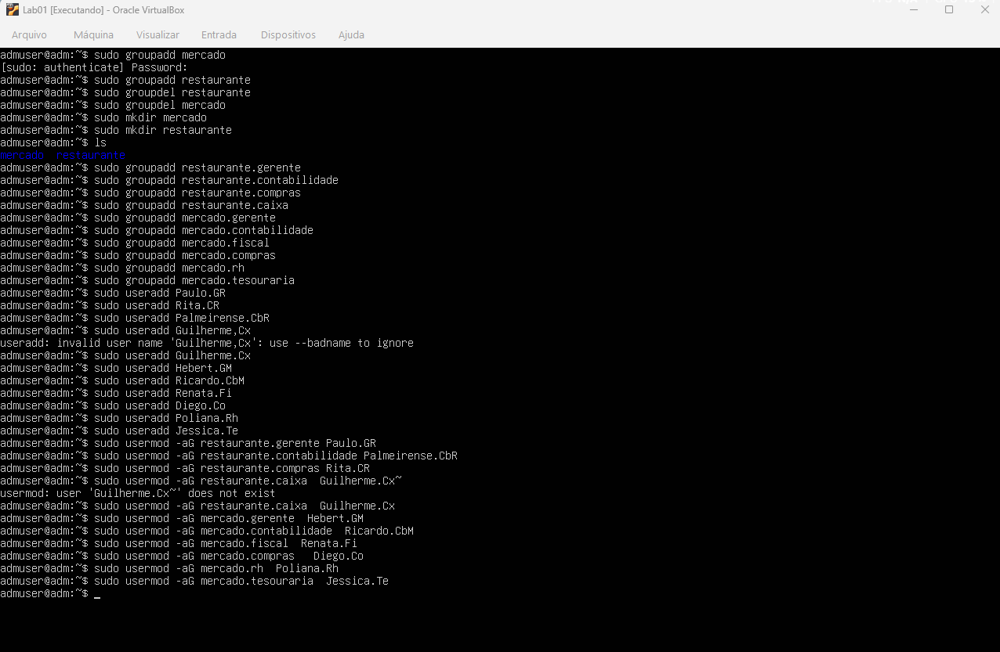
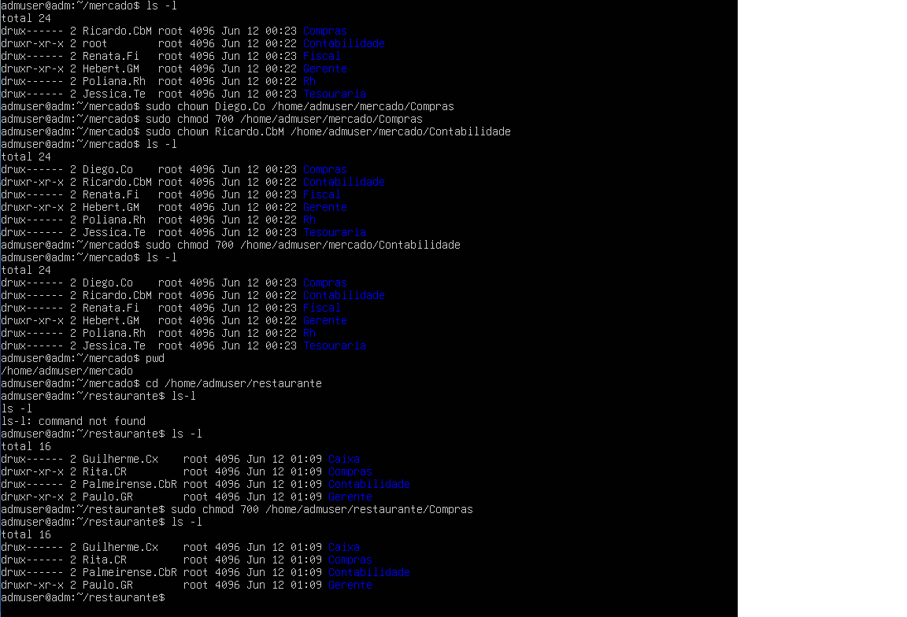

# Lab 02 - Permissões Avançadas e Isolamento de Ambientes

## 🎯 Objetivo
Aprofundar os conhecimentos em administração de sistemas Linux criando uma topologia mais complexa e praticar a aplicação de permissões restritivas para garantir o isolamento total de dados.

## 🏢 Cenário
Criação de um servidor central hospedando os dados de dois negócios distintos: um **Mercado** e um **Restaurante**, cada um com seus próprios departamentos e colaboradores.

### Estrutura das Empresas
* **Mercado:** Gerência, Contabilidade, Fiscal, Compras, RH, Tesouraria.
* **Restaurante:** Gerência, Contabilidade, Compras, Caixa.

---

## 🛠️ Estrutura Criada

### 👤 Usuários
* `Hebert.GM`
* `Ricardo.CbM`
* `Renata.Fi`
* `Diego.Co`
* `Poliana.Rh`
* `Jessica.Te`
* `Paulo.GR`
* `Palmeirense.CbR`
* `Rita.CR`
* `Guilherme.Cx`

### 👥 Grupos
* `mercado.gerente`
* `mercado.contabilidade`
* `mercado.fiscal`
* `mercado.compras`
* `mercado.rh`
* `mercado.tesouraria`
* `restaurante.gerente`
* `restaurante.contabilidade`
* `restaurante.compras`
* `restaurante.caixa`

---

## 💻 Atividades Realizadas

| Ação | Comando Utilizado | Descrição |
| :--- | :--- | :--- |
| **Criação de grupos** | `groupadd` | Definição das estruturas organizacionais de ambos os negócios. |
| **Criação de usuários** | `useradd` | Provisionamento das contas dos colaboradores. |
| **Associação de usuários** | `usermod` | Vinculação dos usuários aos seus respectivos setores (uso da flag `-aG`). |
| **Alteração de propriedade** | `chown` | Transferência da posse dos diretórios para os usuários responsáveis por cada setor. |
| **Controle de permissões** | `chmod` | Aplicação de permissões restritivas (ex: `700`) para isolamento de dados. |

---

## 📚 Conceitos Aprendidos
* Administração de múltiplos ambientes organizacionais no mesmo servidor.
* Resolução de erros de sintaxe em tempo de execução no terminal.
* Compreensão e aplicação de permissões octais no Linux.
* Princípio do Menor Privilégio (PoLP).

## ✅ Resultado
Ao final do laboratório, foi possível criar uma estrutura de diretórios operante e segura. Com a aplicação do comando `chmod 700`, garantiu-se que pastas departamentais críticas fiquem completamente invisíveis e inacessíveis para usuários de outros setores, mitigando riscos de acesso não autorizado.

## ✅ Resultado
Estrutura de diretórios operante e segura. Com a aplicação do comando `chmod 700`, garantiu-se que pastas departamentais críticas, como *Contabilidade* e *Compras*, fiquem completamente invisíveis e inacessíveis para usuários de outros setores, mitigando riscos de acesso não autorizado a informações sensíveis.

---

## 📸 Provas de Execução (Prints)

Para demonstrar a eficácia das permissões avançadas, apresento os logs do terminal com a criação da estrutura e a verificação de antes e depois.

**Criação de Grupos e Usuários:**

**Isolamento dos Diretórios:**
As imagens mostram a verificação com `ls -l` antes e depois da aplicação do comando `chmod 700`, comprovando o isolamento dos diretórios departamentais. Apenas os donos têm permissão total, enquanto os outros foram bloqueados.

